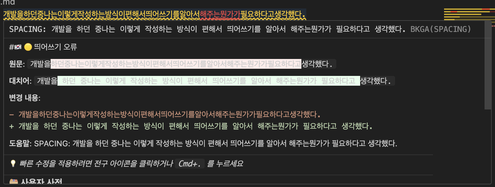
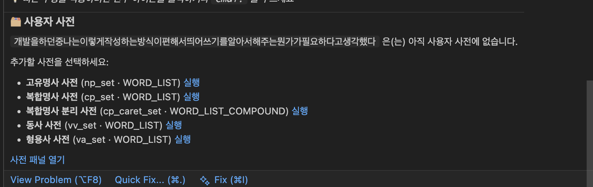

# Bareun Korean Grammar Assistant (BKGA)

[](https://github.com/Hun-Bot2/smart-korean-grammar-assistant/releases)
[](https://marketplace.visualstudio.com/items?itemName=Hun-Bot.bareun-korean-grammar-assistant)
[](LICENSE)


Bareun NLP 엔진을 사용해 마크다운 문서의 한국어 문법·맞춤법·띄어쓰기를 검사하고, 인라인 진단, 호버 설명, 빠른 수정을 제공합니다.

# 설치한 뒤 사용법
1. https://bareun.ai/home 사이트에 접속합니다.
2. 회원가입을 통해 api key를 발급받습니다.
3. 바른 한국어 문법 검사기 설정을 열어서 api key자리에 붙여넣습니다.
    Mac : Cmd + Shift + P -> bkga : 설정열기
    Windows : Ctrl + Shift + P -> bkga : 설정열기

## 오류 색상 구분
- **맞춤법 오류**: 🔴 빨간색 밑줄
- **띄어쓰기 오류**: 🟡 노란색 밑줄  
- **표준어 의심**: 🟣 보라색 밑줄
- **통계적 교정**: 🔵 파란색 밑줄
- **기타/정보**: ⚪ VS Code 기본 오류 색상 (Bareun 카테고리를 판별하지 못한 경우)

## Keyboard Shortcuts

| 명령 | Mac | Windows/Linux | 기능 |
|------|-----|---------------|------|
| 활성화/비활성화 | `Cmd+K G E` | `Ctrl+K G E` | BKGA 토글 |
| 현재 문서 분석 | `Cmd+K G A` | `Ctrl+K G A` | 열린 문서 즉시 분석 |
| 선택 영역 자동 수정 | `Cmd+K G F` | `Ctrl+K G F` | 선택한 문장을 한 번에 교정 |
| 사용자 사전 패널 열기 | `Cmd+K G D` | `Ctrl+K G D` | 사용자 사전 패널 표시 |

> **팁**: 
> - 개별 오류 수정: `Cmd+.` (또는 `Ctrl+.`)로 빠른 수정 메뉴 열기
> - 여러 줄 한번에 수정: 텍스트 선택 후 `Cmd+K G F`


## 기본 사용법
1. 마크다운 파일(`.md`)을 엽니다.
2. BKGA가 문서를 자동으로 분석합니다.
3. 문법/맞춤법 문제는 밑줄로 표시됩니다.
4. 밑줄 친 텍스트에 마우스를 올려 상세 내용을 확인합니다.

### 수정 방법
- **개별 수정**: 전구 아이콘 클릭 또는 `Cmd+.`로 빠른 수정
- **여러 줄 한번에**: 텍스트 선택 후 `Cmd+K G F`로 자동 수정
- **상태 확인**: 오른쪽 하단 상태 표시줄에서 문제 개수 확인

## 30초 사용 가이드


## Screenshots

#### Hover Information



#### User Dictionary



#### Problem Terminal


## Configuration
- `bkga.bareun.apiKey` — Bareun API 키 (**필수**)
- `bkga.enabled` — Extension 활성화 여부 (기본값: `true`)
- `bkga.includePaths` — 분석할 파일 패턴 (기본값: `["**/*.md"]`)
- `bkga.ignoreEnglishInMarkdown` — 마크다운 문서에서 영어 텍스트는 진단에서 제외 (기본값: `true`)
- `bkga.customDictionary.*` — 사용자 사전 연동 설정 (엔드포인트, 도메인, 단어 목록)

### 사용자 사전 연동

Bareun의 [Custom Dictionary](https://bareun.ai/custom-dict) / [Cloud API 안내](https://bareun.ai/docs?childUrl=howtouse/cloud-api/)를 그대로 사용합니다. `[수학, 알고리즘, 프로그래밍 등 기초 과목을 공부하심]`처럼 고유한 표현을 사전에 넣어 띄어쓰기 오탐을 막을 수 있습니다.

1. VS Code 설정에서 `bkga.customDictionary.enabled`를 켜고 `domainName`을 지정합니다. `endpoint`를 비워 두면 기본 Bareun 사용자 사전 엔드포인트(`https://api.bareun.ai/bareun.CustomDictionaryService/UpdateCustomDictionary`)가 사용됩니다.
2. 명령 팔레트에서 `BKGA (Bareun Korean Grammar): 선택 텍스트를 사용자 사전에 추가`를 실행해 선택 영역을 어떤 사전에 넣을지 고릅니다.
3. 서버에 반영하려면 `BKGA (Bareun Korean Grammar): 사용자 사전 동기화`를 실행하세요. 동일 도메인 이름의 사전은 통째로 교체됩니다.
4. VS Code에서 `BKGA (Bareun Korean Grammar): 사용자 사전 패널 열기`를 실행하면 카테고리별 카드 UI로 현재 단어 목록을 확인할 수 있습니다.
5. 마크다운에서 단어 위에 마우스를 올리면 사용자 사전 상태가 함께 표시되어, 한 번의 클릭으로 해당 사전에 추가하거나 삭제할 수 있습니다.

## Status Bar Indicators

- `BKGA` — 대기 상태
- `BKGA: 분석 중...` — 문서 분석 중
- `BKGA: 문제없음` — 문제없음
- `BKGA: N개 문제` — 문제 N 개 감지
- `BKGA: 오류` — 분석 오류

## Notes

- 이 확장은 한국어 마크다운 문서 작성에 최적화되어 있습니다.
- **Bareun API 키가 필수입니다.** [bareun.ai](https://bareun.ai/)에서 무료로 발급받을 수 있습니다.
- API 키 없이는 기본적인 공백 검사만 수행됩니다.
- 코드 블록(` ``` `)과 인라인 코드(`` ` ``)는 Bareun API가 자동으로 분석에서 제외합니다.
- 빠른 타이핑 시 과도한 API 호출을 방지하기 위해 350ms 디바운스가 적용됩니다.

## 버그 리포트 & 최근 수정

- **인라인 단축키 텍스트 오탐(2025-11)**: 한국어와 영어가 겹친 문자열이 띄어쓰기 오류로 잡히던 문제를 해결했습니다. 마크다운 인라인 코드·펜스 코드 범위를 사전에 계산해 진단에서 제외하도록 수정했습니다.
- **혼합 언어/링크 오탐(2025-11)**: `선택하여 (Cmd+A)`·`[bareun.ai](https://bareun.ai/)`·`피드백,버그`처럼 한글과 영어·기호가 섞인 구문이 SPACING 경고로 표시되던 현상을 수정했습니다. 단축키 패턴, URL/이메일, 마크다운 링크, 쉼표로 이어진 한글 구문 등을 감지하면 해당 진단을 무시하도록 로직을 보강했습니다.

## Contributing

피드백,버그 리포트, 기능 제안, 풀 리퀘스트를 환영합니다!

- **Issues**: [GitHub Issues](https://github.com/Hun-Bot2/smart-korean-grammar-assistant/issues)
- **Repository**: [GitHub](https://github.com/Hun-Bot2/smart-korean-grammar-assistant)
- **Email**: [contact@hun-bot.dev](mailto:contact@hun-bot.dev)

## License

MIT License - 자세한 내용은 [LICENSE](LICENSE) 파일을 참조하세요.
